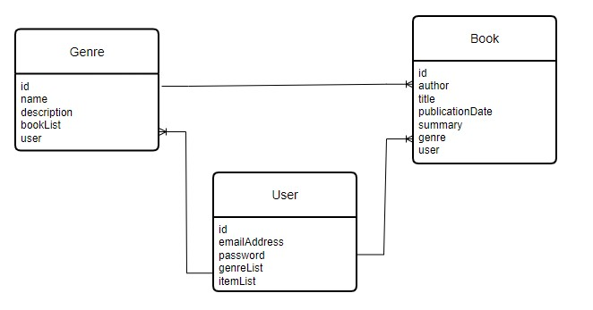
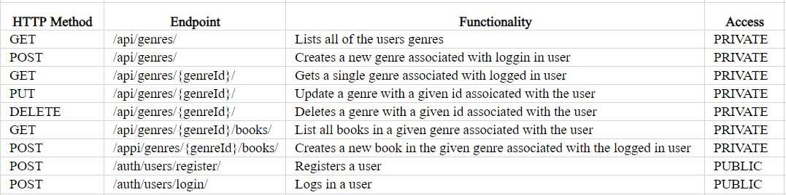

# Spring Boot Mini Project
## Overview
This project is a book management system API built using Spring Boot that allows users to keep track of their book collection by genre.
It uses the H2 database to store data and runs on the Apache Tomcat Sever. Authentication and authorization are implemented using Spring Security and JSON web tokens  to secure access to endpoints.

## Technologies used

- Java
- Spring Boot Framework
- Spring Security
- JSON Web Tokens
- H2 Database
- IntelliJ

## User Stories

As a user I want to be able to register for an account so that I can save genres and books to it

As a user I want to be able to log into my account so that I save and view genres and books

As a user I want to be able to add genres and books to my account so that I can keep track of them

As a user I want to be able to see a list of books I have saved by genre

As I user I want my account to be secure so that no unauthorized user can access my account

## ERD diagram

## Endpoints

